#### This tutorial was written by Nihar Garg for the Columbia University Robotics Club.
It is also available for use here: https://github.com/columbia-university-robotics/moveit-instructions/tree/main/bootubuntufromUSB-instructions

# How to boot Ubuntu from USB flash drive
There are many options for installing Ubuntu on your computer: Native boot or dual-boot, Boot from USB flash drive, Virtual machines, Docker, etc.

In this tutorial we will learn how to boot from USB flash drive. This option is good because it does not alter your existing operating system.
(These instructions should work whether you have a PC or Mac.)

#### Important Note:
The screenshots in the tutorial below are for reference only, and the USB sizes that are in the images may not match what is stated in the text. Please follow the written steps, and only use the screenshots to double check your work. Please make sure to choose the correct option for your USB size, else you risk deleting all of your computer's memory.

## Step 1: Gather materials

#### Step 1A: Buy a 128GB flash drive with fast read/write speeds
I bought the drive in [this link](https://www.amazon.com/dp/B07BPK3XWW), but there are many others available at different price points. Make the USB you buy is at least a USB 3.0 and has at least 16GB capacity.

#### Step 1B: Get a 4GB USB stick
You should have a random flash drive lying around your house. You will need it!

#### Step 1C: Make sure you have at least two USB type A ports on your machine.
If not, you will need a [USB multiport hub](https://www.amazon.com/Anker-Extended-MacBook-Surface-Notebook/dp/B07L32B9C2).

#### Step 1D: Get an external mouse and keyboard (Not required for all users)
I would recommend getting an external mouse and keyboard because Ubuntu may not recognize the in-built mouse and keyboard due to missing plugins. Keep in mind that if you get a wired external mouse and keyboard then ensure that your machine has that many USB type A ports.

On my Microsoft Surface Pro, I was able to use the trackpad but not keyboard, so I enabled the on-screen keyboard through the Accessibility settings. On my Microsoft Surface Laptop, I wasn't able to use the trackpad or keyboard, leaving me without any way to use the machine. So I had to get an external mouse and keyboard.

## Step 2: Download Ubuntu ISO file
Go to [Ubuntu Download Page](https://ubuntu.com/download/desktop) and get Ubuntu 20.04.

## Step 3: Write the ISO to the smaller (4GB) USB stick
Ignore step 3 if you have macOS. Instead, follow instructions on [this link](https://ubuntu.com/tutorials/create-a-usb-stick-on-macos#3-prepare-the-usb-stick).

#### Step 3A: Download Rufus
Rufus is a free and open-source USB stick writing tool. I downloaded the portable version from [this link](https://rufus.ie/).

#### Step 3B: Plug in the 4GB USB to your computer

#### Step 3C: Open Rufus and select device
Click on the 4GB USB device from the “Device” field.

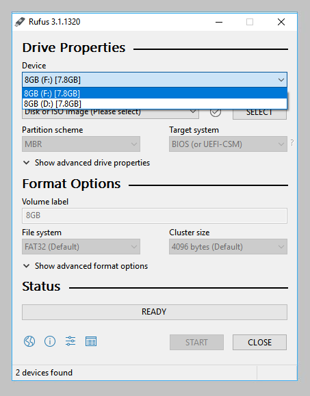

#### Step 3D: Select the Ubuntu ISO file
Click the select to the right of “Boot selection”. Select the appropriate ISO file and click on Open.

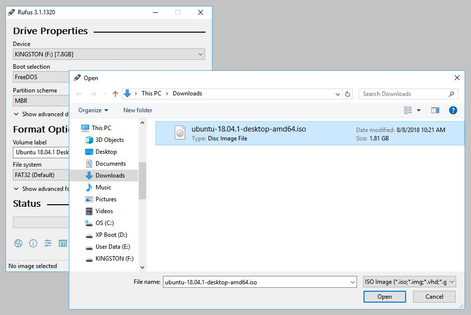

#### Step 3E: Write the ISO
Leave all other parameters with their default values and click start to initiate the write process.

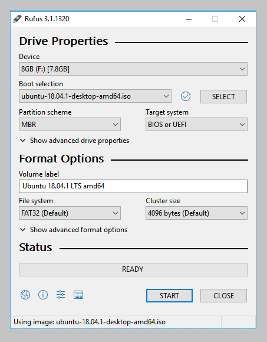

#### Step 3F: Warnings
You may be alerted that Rufus requires additional files to complete writing the ISO. If this dialog box appears, select yes to continue.
You will then be alerted that Rufus has detected that the Ubuntu ISO is an ISOHybrid image. Keep Write in ISO Image mode selected and click on OK to continue.
Rufus will also warn you that all data on your selected USB device is about to be destroyed. This is a good moment to double check you’ve selected the correct device before clicking OK when you’re confident you have.

#### Step 3G: Installation complete
The ISO will now be written to your USB stick, and the progress bar in Rufus will give you some indication of where you are in the process.
When Rufus has finished writing the USB device, the Status bar will be green filled and the word READY will appear in the center. Select CLOSE to complete the write process.

## Step 4: Boot your machine from your newly written USB
Read your manufacturer’s instructions on how to boot from a USB.

Note: My Microsoft Surface Laptop would continuously boot from Windows even though I pressed the Volume Down key while booting. To fix this you will need to go to the UEFI Firmware settings on your machine (either by holding the Volume Up key while booting, or go to Windows Settings -> Update & Security -> Recovery -> Advanced Startup -> Restart Now). Then your machine will restart into the UEFI Firmware. Navigate to "Boot Configuration" and move the order of "USB Device" to the top (above Windows). My Surface Laptop then boots directly in recovery mode to the GNU GRUB menu. Type "exit" and then press enter to be taken to the recovery menu again, from where you can select "Boot from USB" again.

#### Step 4A: Power off your computer and remove the 4GB USB.

#### Step 4B: Plug in your 4GB USB into your computer or into the USB hub again.

#### Step 4C: Power on your machine into the Boot Menu (by pressing F12 or volume down or whatever your manufacturer steps are).

#### Step 4D: Select the “boot from USB” option.
My Windows machine would display two options: one to “boot from USB” and another to “boot from ubuntu”. If this happens to you, choose the “boot from USB” option.

## Step 5: Try Ubuntu
Your machine should boot as Ubuntu OS on the 4GB USB.

#### Step 5A: Select the “Try Ubuntu” option.
The system will boot into the Ubuntu live desktop environment.

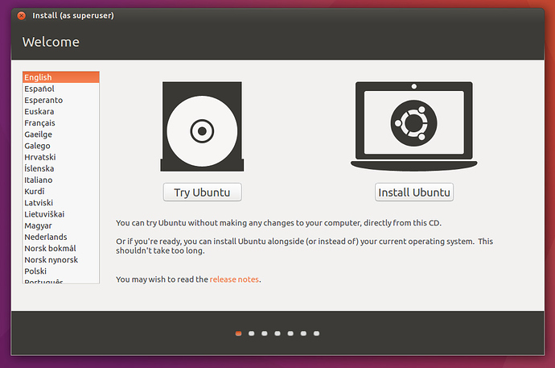

## Step 6: Partition your 128GB USB
We will now configure your 128GB USB to have a persistent storage space. This means that you can install software and edit code on it, and changes will be preserved each time you reboot.

#### Step 6A: While leaving your 4GB USB inserted, also insert your 128GB USB into the computer or USB hub.

#### Step 6B: From the left dock panel, click “show applications” and search for Gparted.

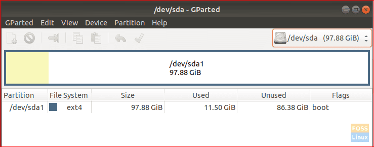

## This is the most critical step!!! Choosing a wrong device could destroy the data on your PC.

#### Step 6C: At the top-right of the GParted window, select your USB from the drop-down menu.
Pay attention to the drives and make sure you are selecting the 128GB flash drive (should be sdb).

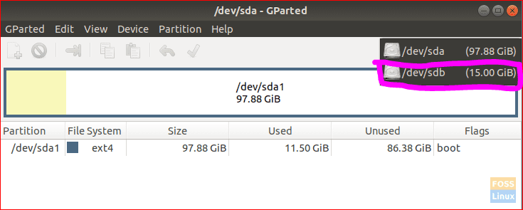

#### Step 6D: Clear partitions on the USB drive by right-clicking on your USB, choose Format then select the cleared option.

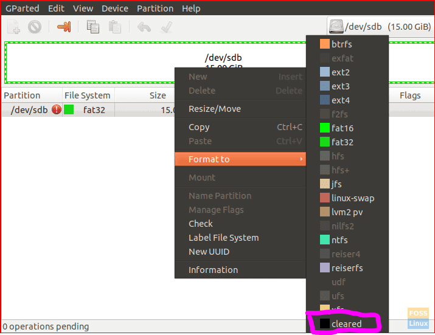

#### Step 6E: Click the apply button that is the green colored right mark located on the top panel.

#### Step 6F: An alert message will appear warning you about losing data when formatting the USB.  Click Apply on the alert message.

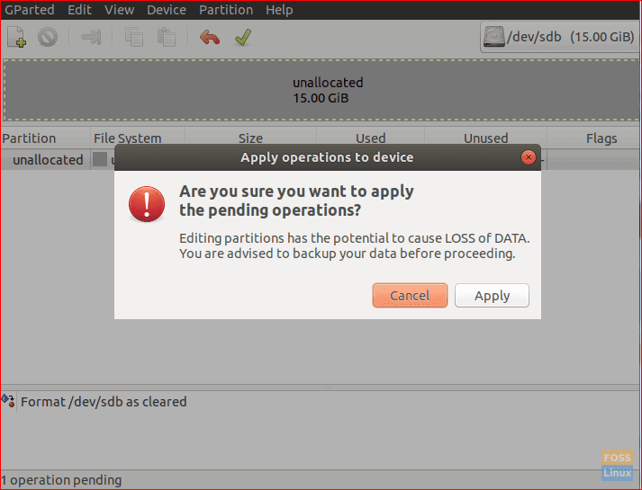

#### Step 6G: After the operation completes successfully, click close to continue.

#### Step 6H: The USB should be like the below screenshot. You can now close the GParted application. You have successfully partitioned your USB drive to be able to install Ubuntu.

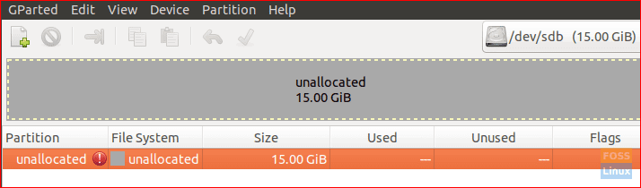

## Step 7: Install Ubuntu on the 128GB USB

#### Step 7A: From the desktop, click on the install Ubuntu icon.

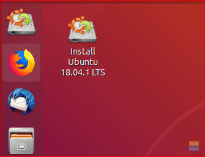

#### Step 7B: Continue installation
Now select your preferred language and click on the Install Ubuntu button. Press continue.
Next, select the Keyboard layout, here I am choosing English US. You can select any other layout which you are using right now on your Windows 10 PC or laptop. Press continue.
Select Normal Installation and the “install third-party software” button. Press continue.

#### Step 7C: In the installation type screen choose “something else” option then press Continue.

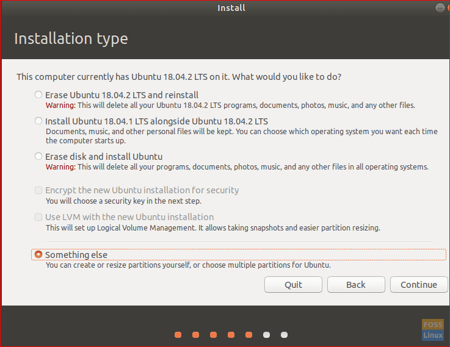

#### Step 7D: Choose the USB and next we will start creating partitions.

#### Step 7E: Choose the new partition table button. Then press the plus sign to create new partitions.

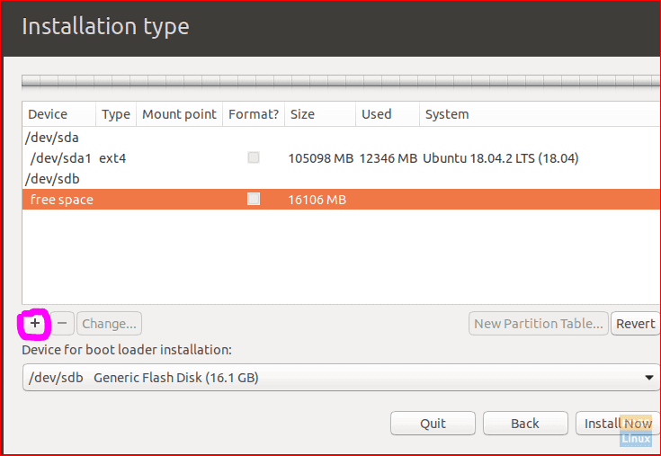

#### Step 7F: Create the below two paritions
1. FAT32 partition
- Set the size to be around 74000 MB
- Set the mount point to /fatpartition
- Location for new partition: Beginning of this space
- Primary partition
2. EXT4 partition
- Set size to the remaining space
- Set the mount point to /
- Location for new partition: Beginning of this space
- Logical partition

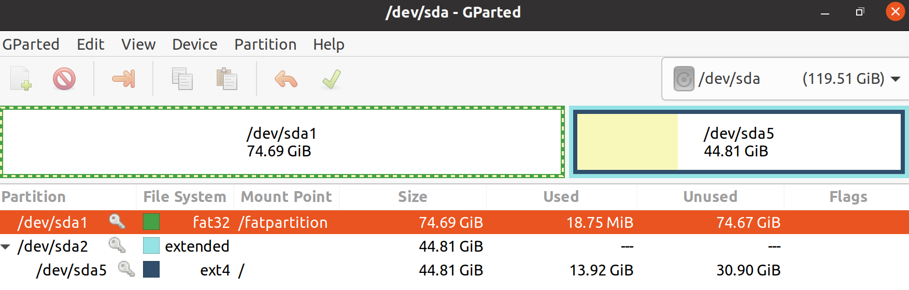

You can also use the below screenshot for reference. This screenshot has a swap partition as well but we have not done it for our use case.

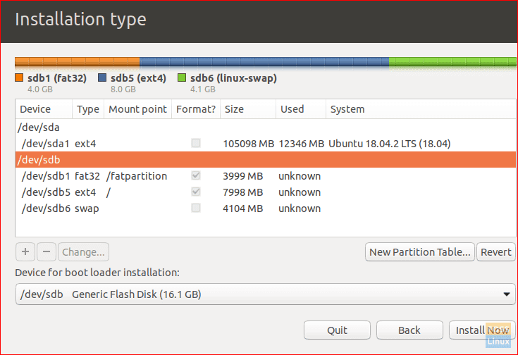

#### Step 7G: Press Install now to start the installation.

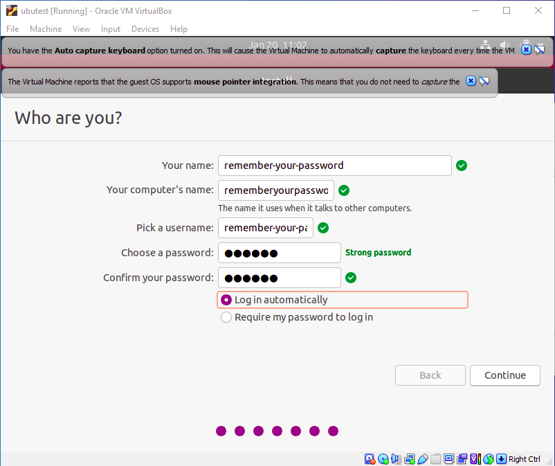

#### Step 7H: After installation complete, click “Continue Testing”.

#### Step 7I: Power off your machine.

#### Step 7J: Remove both the 4GB USB and the 12GB USB

## Step 8: Plug in the 128GB USB and reboot your machine with the Boot from USB option.

If (while trying to boot your machine in Ubuntu or Windows) your machine takes you to GRUB screen with a command line, just type "exit" and the machine will take you to an Advanced Recovery page where you can choose to boot from whatever device you desire.

## Step 9: Welcome to Ubuntu

#### Step 9A: Now enter the password which you created during installation setup and you will be logged into Ubuntu desktop.

#### Step 9B: Right click an empty part of the desktop and then press "Display Settings"

#### Step 9C: Click on the "Power" tab (near the bottom). Where it says Power Saving click on where it says "5 minutes" and change it to "Never".

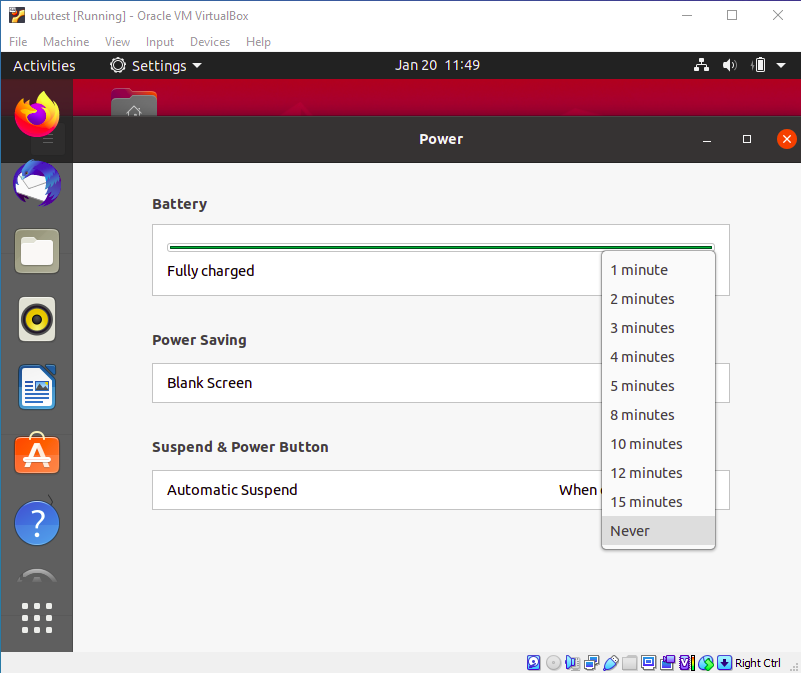

#### Step 9D: Install software updates. Install zoom and slack.

## Step 10: ENJOY!

#### Important Notes and Fixes for Issues You May Come Across:
1. Do not remove the USB while your machine is running Ubuntu. Always make sure to power the machine off before removing the USB.
2. After install is complete, I would recommend that you try to boot your computer using Windows/macOS to make sure you are able to boot normally.
3. My Microsoft Surface Laptop gets stuck in the boot mode when I try to boot from Windows after having just run Ubuntu.
- That is because the UEFI Firmware settings (Boot Configuration) added a new "ubuntu" boot option to the top of the list.
- You will need to restart your machine and go back to UEFI Firmware settings (as described in step 4).
- Delete the ubuntu option and leave the remaining options as is (leave USB above Windows).
- Restart your machine and it should boot in Windows.
